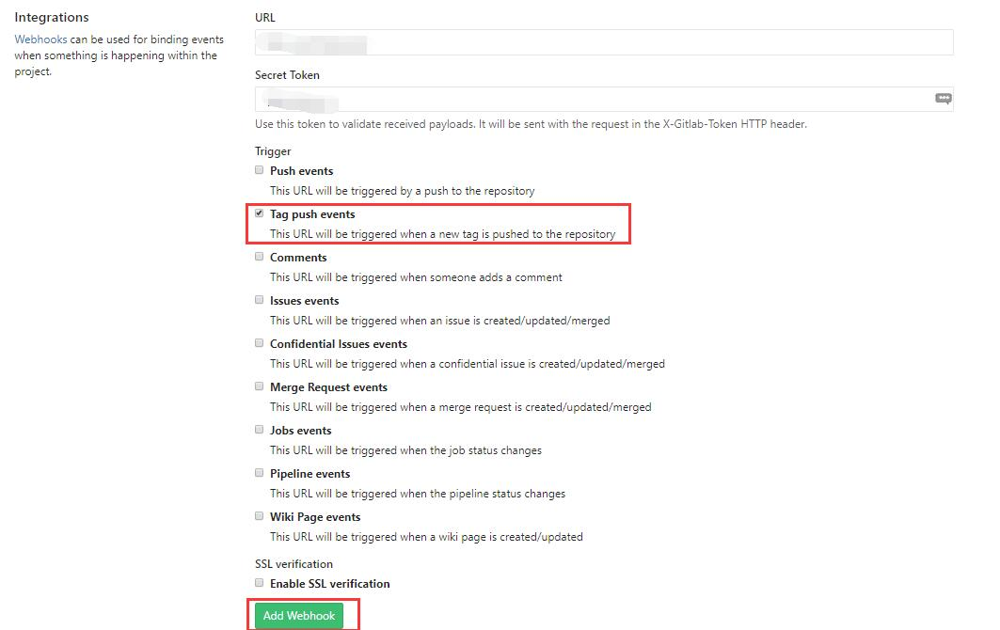
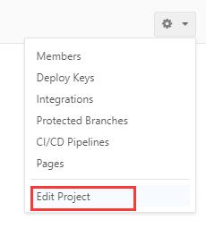
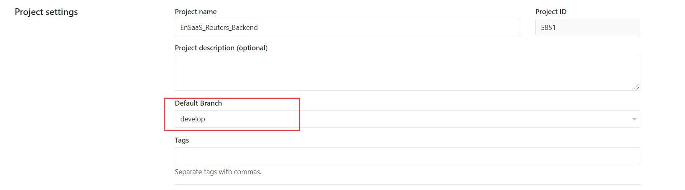

# gitlab ci 文档

## 1. 在 gitlab 项目中创建 webHook 触发器  
    settings --> integrations  
   > - 配置 URL
   > - 配置 Secret Token
   > - 配置 Trigger 
    
  

## 2. 配置项目 default_branch  
    settings --> Edit Project  
    - pipelien 会根据 default_branch 的分支进行构建   
      
      
    
## 3. 备注  
    项目规范
    - Dockerfile 放在项目根目录下
    - helm chart 放在项目charts目录下
    - arfa harbor 上的项目名称和 git 上的项目名词保持一致（大小写忽略）
